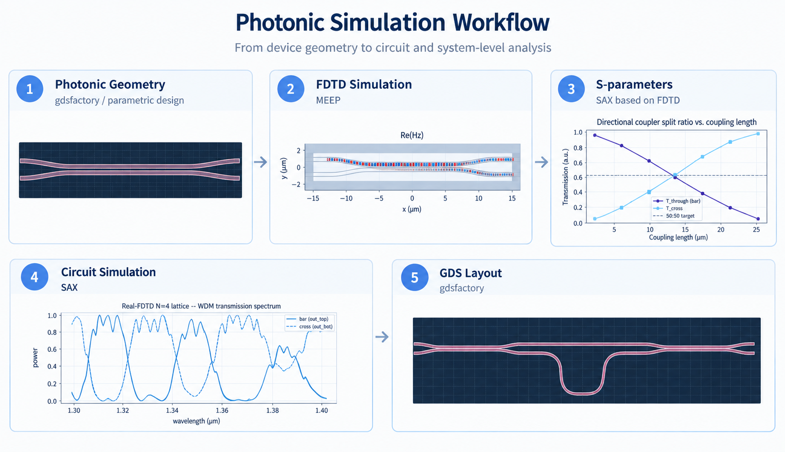

# photonics-simulation-toolkit

An end-to-end toolkit for building, physically validating, and composing
silicon photonic integrated circuit (PIC) components — from
[Meep](https://meep.readthedocs.io/) FDTD simulation, through
[SAX](https://flaport.github.io/sax/) circuit-level composition, to
[gdsfactory](https://gdsfactory.github.io/gdsfactory/) GDS layout output.



Every stage above is backed by a real Meep FDTD run — not an idealized or
pre-characterized model — and that measured physics (amplitude *and* phase)
is carried all the way through to circuit-level composition and a
fabricable GDS layout.

Built through iterative pair-programming with
[Claude Code](https://claude.com/claude-code); every physical model,
tolerance, and validation judgment in this repo was made and independently
verified by me — see [CLAUDE.md](CLAUDE.md) for the conventions that keep
that collaboration disciplined, and
[docs/troubleshooting_log.md](docs/troubleshooting_log.md) for the actual
diagnostic record.

## The pipeline

1. **`notebooks/0N_*.ipynb`** — one notebook per PIC component. Builds the
   geometry (gdsfactory-first), runs a Meep FDTD simulation, characterizes
   it (S-parameters, resonance, extinction, Vπ, etc.), and saves the result
   as `data/design_points/<component>.yaml` — the single source of truth
   for that component's parameters and fitted/measured model.
2. **`src/pic_toolkit/models/<component>.py`** — a **Meep-free** twin of each
   component that reads its cached design point and serves it as a
   SAX-compatible model, so downstream circuit work never needs to re-run
   FDTD.
3. **`circuits/`** — SAX circuit-level compositions built purely from those
   cached component models, comparing an ideal analytic model against the
   genuinely FDTD-measured one, then exporting the result as GDS.

Each notebook is written as a reader-facing deliverable — not personal lab
notes — with a consistent structure and explicit **STOP** checkpoints before
any expensive or consequential step.

## Why this is more than a set of simulation notebooks

- **The loop actually closes.** Component-level FDTD results don't stay in
  their own notebook — `circuits/wdm_sax.ipynb` is the first module in this
  repo to call `sax.circuit()`, composing cached, genuinely FDTD-measured
  coupler and delay-arm models (preserving complex S-parameters, magnitude
  *and* phase, not just power) into a working interferometric filter, then
  exporting it as GDS.
- **Real physics measurably changes the outcome.** In
  `circuits/wdm_mux4_sax.ipynb`'s 4-channel WDM demultiplexer, moving from a
  2-coupler to a 4-coupler lattice — validated with real FDTD data, not just
  an ideal model — improved the worst channel's extinction ratio from
  **1.7 dB to 10.1 dB**. That notebook also produces this repo's first
  *branching* (non-series) GDS layout.
- **Includes a genuinely advanced simulation technique**, not just parameter
  sweeps: `04_bend_topology_optimization.ipynb` uses Meep's adjoint-based
  topology optimization (`autograd` + `nlopt`) to optimize a waveguide
  bend's geometry directly from a gradient of the simulated field.
- **9 of 12 components are fully validated end-to-end** — cached ground-truth
  YAML *and* a Meep-free SAX model — not just a one-off simulation notebook;
  see the "cached model" column below.

## Components

| Notebook | Component | Cached model |
|---|---|---|
| `01_waveguide_baseline.ipynb` | Straight waveguide baseline (TE mode, cross-section characterization) | ✅ |
| `02_bent_waveguide.ipynb` | Bent waveguide (radius sweep, circular vs. Euler bends) | ✅ |
| `03_mzi_arm.ipynb` | MZI delay arm (jog geometry) | ✅ |
| `03b_mzi_arm_dense_sweep.ipynb` | Densified ΔL sweep for the delay arm | — (supporting sweep) |
| `04_bend_topology_optimization.ipynb` | Adjoint topology optimization of a waveguide bend | ✅ |
| `05_racetrack_resonator.ipynb` | Racetrack resonator | ✅ |
| `06_directional_coupler.ipynb` | Directional coupler (baseline) | ✅ |
| `06b_directional_coupler_gap_sweep.ipynb` | 2D gap × length sweep for the coupler | — (supporting sweep) |
| `07_mzi.ipynb` | Passive Mach-Zehnder interferometer | ✅ |
| `08_mzm.ipynb` | Mach-Zehnder modulator (push-pull Vπ) | ✅ |
| `09_grating_coupler.ipynb` | Grating coupler (x-z cross-section) | not yet promoted |
| `10_add_drop_ring_resonator.ipynb` | Add-drop ring resonator | ✅ |

## Circuit-level compositions

Under `circuits/` — never imports Meep, only wires together already-cached
component models:

- **`wdm_sax.ipynb`** — single-stage cascaded-coupler lattice filter (N=2 vs.
  N=4 couplers), built both as an ideal analytic model and from genuinely
  FDTD-measured component S-parameters, with GDS layout export.
- **`wdm_mux4_sax.ipynb`** — 4-channel WDM demultiplexer using a cascaded
  binary-tree ("Mux4") topology built from the `wdm_sax` lattice as its
  per-node building block, with GDS layout export. Real FDTD data pushed the
  worst channel's extinction from 1.7 dB (N=2) to 10.1 dB (N=4).

See [circuits/README.md](circuits/README.md) for the full derivation.

## Repository structure

```
notebooks/            Component-building notebooks (01-10, + 03b/06b)
circuits/              SAX circuit-level compositions + GDS exports
src/pic_toolkit/
  meep_sim/            Meep FDTD simulation modules (one per component)
  models/               Meep-free SAX-compatible twins, read cached design points
  circuits/             SAX circuit building blocks (lattice, mux tree)
  params.py, sweep.py, sparams.py, checks.py, design_points.py, style.py, viz.py
data/
  design_points/        Per-component YAML — the source of truth
  sparams/               Cached S-parameter artifacts (.npz + .json) per component
docs/
  simulation_settings_record.md   Parameter/tolerance rationale per component
  troubleshooting_log.md          Process/workflow issues and fixes
scripts/               One-off sweep runner scripts
```

## Setup

```bash
conda env create -f environment.yml
conda activate mp
```

This installs Python 3.10, `pymeep`, `sax`, `gdsfactory`, and an editable
install of this package (`pic_toolkit`).

## Usage

```bash
conda activate mp
jupyter lab notebooks/
```

Notebooks are meant to be run cell-by-cell, not with "Run All" — each has
explicit **STOP** checkpoints before any expensive FDTD run or before saving
a new design point. See [CLAUDE.md](CLAUDE.md) for the full set of
conventions (notebook structure, shared plotting style, geometry-construction
pattern, and known simulation gotchas) before editing any notebook or
`src/pic_toolkit/meep_sim/*.py` module.

## Tech stack

- [Meep](https://meep.readthedocs.io/) (`pymeep`) — FDTD electromagnetic simulation, including adjoint topology optimization (`autograd` + `nlopt`)
- [gdsfactory](https://gdsfactory.github.io/gdsfactory/) — parametric GDS layout generation
- [SAX](https://flaport.github.io/sax/) — circuit-level S-parameter composition

## More documentation

- [CLAUDE.md](CLAUDE.md) — repo conventions for notebooks and simulation modules
- [docs/simulation_settings_record.md](docs/simulation_settings_record.md) — why each non-obvious parameter/tolerance is what it is
- [docs/troubleshooting_log.md](docs/troubleshooting_log.md) — process/workflow issues hit during development
- [circuits/README.md](circuits/README.md) — circuit-level composition details
